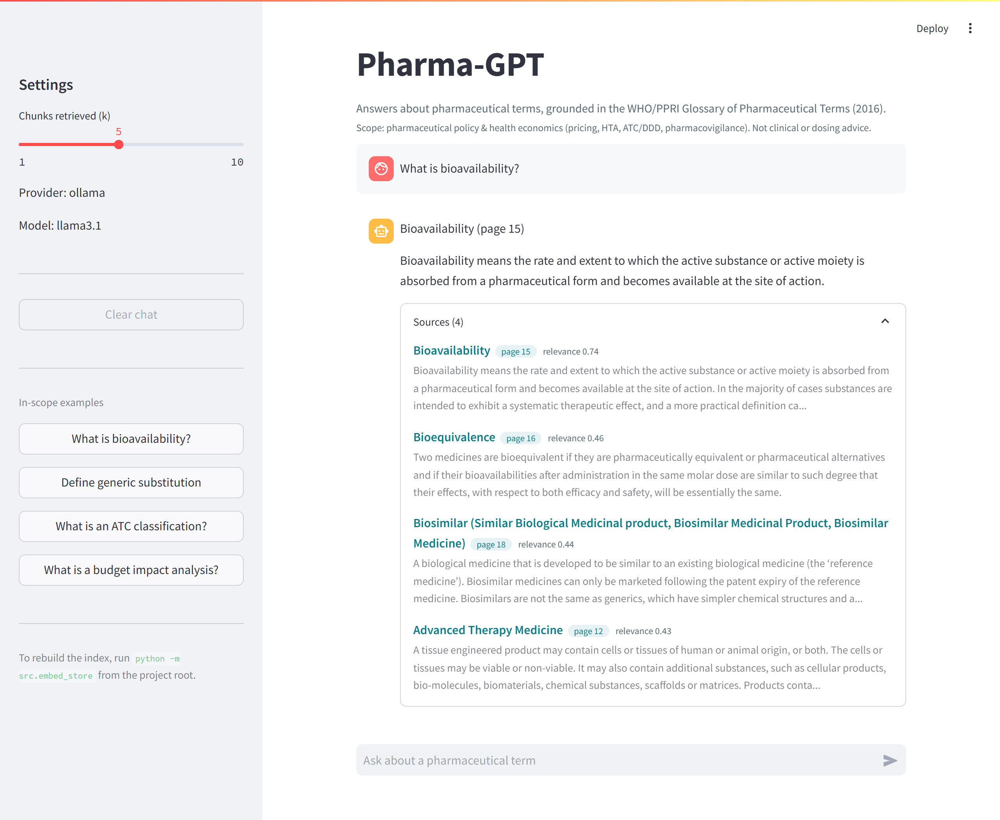

# Pharma-GPT

A retrieval-augmented chatbot that answers questions about pharmaceutical
terminology, grounded strictly in the WHO/PPRI *Glossary of Pharmaceutical Terms*
(2016). It retrieves the relevant glossary entries and asks an LLM to answer only
from them, citing the term and page. If the glossary does not cover a question, it
says so instead of guessing.

[](https://pharma-gpt-rag-dpstrt54vjs64peusbfvzm.streamlit.app/)

**Live demo:** https://pharma-gpt-rag-dpstrt54vjs64peusbfvzm.streamlit.app/

<!-- Add a UI screenshot at docs/screenshot.png and uncomment:
 -->

## Problem

Regulatory-affairs and market-access teams repeatedly hit unfamiliar pharma-policy
and health-economics terms (ATC, DDD, QALY, biosimilar, budget impact analysis).
The authoritative reference is a 140-page PDF, so a lookup means scrolling and the
answer carries no traceability. Pharma-GPT turns that PDF into a grounded lookup:
ask in natural language, get the definition **with its glossary term and page**, and
get an explicit "not covered" when the question falls outside the glossary.

Success criteria: (1) every answer grounded in a retrieved entry and cites term +
page; (2) out-of-scope questions (e.g. drug dosages) are refused, not guessed;
(3) retrieval finds the right entry (hit@3 0.87); (4) interactive latency (streamed
tokens; a one-time ~9s index build on a cold deploy).

## Corpus

One 140-page PDF with a real text layer (no OCR). Glossary content is pages 9-128;
front matter (1-8) and the reference list (129-140) are excluded. Its scope is
pharmaceutical **policy and health economics** — pricing, reimbursement, HTA,
ATC/DDD, pharmacovigilance — not drug formulations or clinical dosing, so formulation
questions (e.g. enteric coating) fall outside it by design and are refused. Parsed
into **413 entries** `{term, definition_text, sources[], page_start}`. The one
non-obvious thing: pdfplumber renders bold text (every term heading) as each glyph
repeated four times — `AAAABBBBCCCC` for `ABC`. That artifact is both the problem
and the solution — it is collapsed to recover the term and used as the heading
detector. See [DECISIONS.md](DECISIONS.md).

## Architecture

```
  Pharmacy_Dictionary.pdf
          |  ingest.py      pdfplumber -> de-bold -> parse entries
          v
  413 entries (entries.json)
          |  chunking.py    one entry = one chunk; 23 long entries split
          v                 with term prefix + 150-char overlap
  444 chunks
          |  embed_store.py all-MiniLM-L6-v2 (384-dim, normalized, cosine)
          v
  ChromaDB  <-- HNSW, search_ef=200 (deterministic at this scale)
          |  rag_chain.py   query -> embed -> top-5 retrieve
          v
  grounded prompt  (answer only from context, cite term+page, refuse if uncovered)
          |  llm_factory.py Gemini gemini-2.5-flash  |  Ollama llama3.1
          v
  streamed answer + Sources panel   (app.py, Streamlit)
```

## Retrieval evaluation

30 gold queries, 10 per category; the expected term must appear in the top-k
retrieved chunks. Reproducible — `python -m src.eval_retrieval` prints the same
table every run (see *Design decisions* for why).

```
category         n    hit@1    hit@3    hit@5
---------------------------------------------
direct          10     1.00     1.00     1.00
paraphrased     10     0.40     0.70     0.70
abbreviation    10     0.70     0.90     0.90
---------------------------------------------
overall         30     0.70     0.87     0.87
```

Paraphrase queries are worded to share few words with their target definition, so
that score measures semantic retrieval, not lexical overlap. `hit@3 == hit@5`
everywhere: when the right term is retrievable it is already in the top 3, so the
remaining misses are recall failures, not ranking. Generation quality is evaluated
separately, below.

## Generation evaluation

Two checks on the answers themselves, layered on the retrieval hit@k above:

- **Out-of-scope refusal — 3/3.** The adversarial probes (a drug dose, a
  general-knowledge question, a clinical recommendation) are each refused with the
  glossary-does-not-define-it response rather than answered. Computed by
  `python -m src.eval_ragas` straight from the committed records — no LLM judge, so
  it reproduces offline.
- **RAGAS faithfulness / answer relevancy / context precision.** The harness
  (`src/eval_ragas.py`, deps in `requirements-eval.txt`) scores the 6 in-scope
  answers with an LLM-as-judge. The triad needs ~18+ judge calls, which exceeds the
  Gemini free-tier daily cap (20 requests/day), so scores are not tabulated here; run
  it against a paid key or a local Ollama judge to reproduce. The generated records
  are committed (`data/processed/ragas_records.json`), so the judged inputs are
  inspectable without a run. RAGAS judges an LLM with an LLM — treat it as a
  regression proxy anchored to the retrieval hit@k and the refusal check above, not
  as ground truth.

## Setup

Windows, Python 3.11+. From the project root:

```
python -m venv venv
venv\Scripts\activate
pip install -r requirements.txt
```

The parsed corpus (`data/processed/entries.json`) is committed, so a fresh clone can
build the index without the source PDF:

```
python -m src.embed_store
```

Re-parsing the PDF is only needed if you have the source file and want to change the
ingest logic. Put `Pharmacy_Dictionary.pdf` at `data\raw\Pharmacy_Dictionary.pdf`
first, then:

```
python -m src.ingest        # rewrites data/processed/entries.json
python -m src.embed_store
```

The Streamlit app also builds the index on first boot if it is missing, so running
`src.embed_store` by hand is optional locally.

Pick a provider. **Path A — Gemini (fastest, deployable):** get a free key at Google
AI Studio, then create `.env` from `.env.example`:

```
LLM_PROVIDER=gemini
GOOGLE_API_KEY=your_key_here
```

**Path B — Ollama (local, private):** install Ollama, then:

```
ollama pull llama3.1
```

and set `LLM_PROVIDER=ollama` in `.env`.

Check retrieval and run the app:

```
python -m src.eval_retrieval
streamlit run app.py
```

Generation eval (optional, needs a built index + a working provider):

```
pip install -r requirements-eval.txt
python -m src.eval_ragas --generate   # run the pipeline, save records
python -m src.eval_ragas              # score with RAGAS + refusal check
```

## Deploy to Streamlit Community Cloud

The default Gemini path is chosen so the demo runs on the free tier with no local
model, and `requirements.txt` pins CPU-only torch so the image stays small enough for
it. Deploy steps:

1. Push this repo to GitHub (the committed `entries.json` is all the app needs; the
   PDF and `chroma_db/` stay untracked).
2. On [share.streamlit.io](https://share.streamlit.io), create an app pointing at
   `app.py` on this repo. In **Advanced settings**, set the Python version to
   **3.12** — Cloud now defaults to 3.14, for which the pinned wheels (pillow, grpcio,
   chroma-hnswlib, tokenizers, and the `torch==2.12.1+cpu` build) have no build and
   would fail compiling from source.
3. In the app's **Settings → Secrets**, add (this is the deployment equivalent of
   `.env` — do not commit a `.env`):

   ```
   LLM_PROVIDER = "gemini"
   GOOGLE_API_KEY = "your_key_here"
   ```

4. First boot builds the vector index from `entries.json` (~9s, cached for the life
   of the container); later starts are a no-op. Ollama is not reachable from
   Community Cloud, so the hosted demo must use Gemini.

## Layout

```
src/ingest.py         PDF -> structured entries (data/processed/entries.json)
src/chunking.py       entries -> term-aware chunks
src/embed_store.py    chunks -> ChromaDB (chroma_db/)
src/eval_retrieval.py hit@k over a 30-query gold set
src/eval_ragas.py     generation eval (RAGAS + out-of-scope refusal rate)
src/llm_factory.py    provider selection (gemini | ollama)
src/rag_chain.py      retrieve -> prompt -> answer
app.py                Streamlit chat UI
src/config.py         all paths, model names, and parameters
```

## Key design decisions

Full log with rejected alternatives in [DECISIONS.md](DECISIONS.md); the ones worth
knowing:

- **One entry = one chunk**, not fixed-size windows. A glossary entry is already the
  natural unit of retrieval and answer; only 23 of 413 entries exceed the 1200-char
  cap, and those split on natural boundaries with a term-name prefix so the pieces
  still retrieve on the term.
- **all-MiniLM-L6-v2** for CPU size/speed on a free hosted demo. The honest cost —
  weaker recall on bare acronyms and terse paraphrases — is what the eval measures;
  hybrid BM25+dense or mpnet is the documented first upgrade.
- **ChromaDB** for on-disk persistence + per-vector metadata (term, page, source) in
  one call, which is exactly what citation needs. At 444 vectors the deciding factor
  was less glue code, not speed.
- **Wide HNSW beam (search_ef=200).** Chroma's default of 10 silently dropped true
  nearest neighbours at this small scale and made hit@k vary run to run; widening it
  makes retrieval effectively exact and deterministic. A test guards the fix.
- **Dual LLM provider behind a factory.** One env value picks Gemini (deployable) or
  Ollama (local/private); nothing outside `llm_factory` knows which is active.
- **Build the index on boot** from the committed `entries.json` instead of committing
  `chroma_db/`: a persisted HNSW binary is tied to the Chroma build and OS and can
  fail to load on a different host, and rebuilding keeps the index and embedding
  model in sync.

## Limitations

- **Single document, 2016 vintage.** It knows this glossary and nothing else;
  terminology and figures are frozen at 2016. It is a health-economics/policy
  glossary, so it has no dosage-form or clinical entries — those questions are
  refused, not answered. **Not medical advice.**
- **Dense-only retrieval.** Weak on bare acronyms / closed-form spellings (e.g.
  "copay" vs the glossary's "Co-payment"). Hybrid BM25+dense would close most of the
  gap.
- **No answer-level grounding check.** Refusal and citation are enforced by the
  prompt, not yet verified programmatically after generation.

## License

Code is released under the [MIT License](LICENSE). The WHO/PPRI *Glossary of
Pharmaceutical Terms* (2016) content it references belongs to its respective authors
and is used for reference under its own terms, not relicensed here.

## Future work

- Hybrid retrieval (BM25 union dense) + a reranker; re-run the eval set.
- Acronym/synonym expansion built from the parenthetical aliases in term headings.
- A post-generation check that every cited term appears in the retrieved context.
- A second glossary with namespaced collections to test multi-source retrieval.

## Example

```
Q: What is bioavailability?

A: Bioavailability means the rate and extent to which the active substance or
   active moiety is absorbed from a pharmaceutical form and becomes available at
   the site of action. It is useful to distinguish absolute bioavailability
   (compared with intravenous administration) from relative bioavailability
   (compared with another non-intravenous form).

   Term and page: Bioavailability (page 15)

Q: What is the capital of France?

A: The glossary does not define the capital of France.
```
